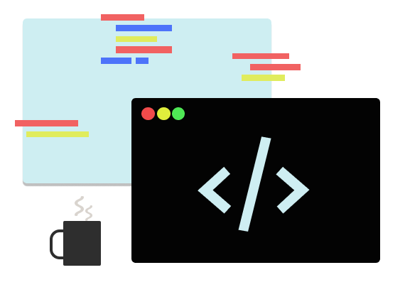

# <b>Hi, i'm Rodrigo Gouveia 🖖</b>

 

 

### <b>About me</b>

I'm a <u>system analyst</u> at <a href="https://b2ml.com.br/">@B2ML Sistemas</a> and <u>backend & frontend</u> developer and i also create some <u>interface prototypes</u>.

### <b>⚡ Skills</b>

- Node.js, ReactJS, ReactNative, Typescript, Java Web, JSF, Primefaces, Hibernate and others.

### <b>🧰 Tools</b>

- VS Code, Figma, NetBeans, Git and others.

